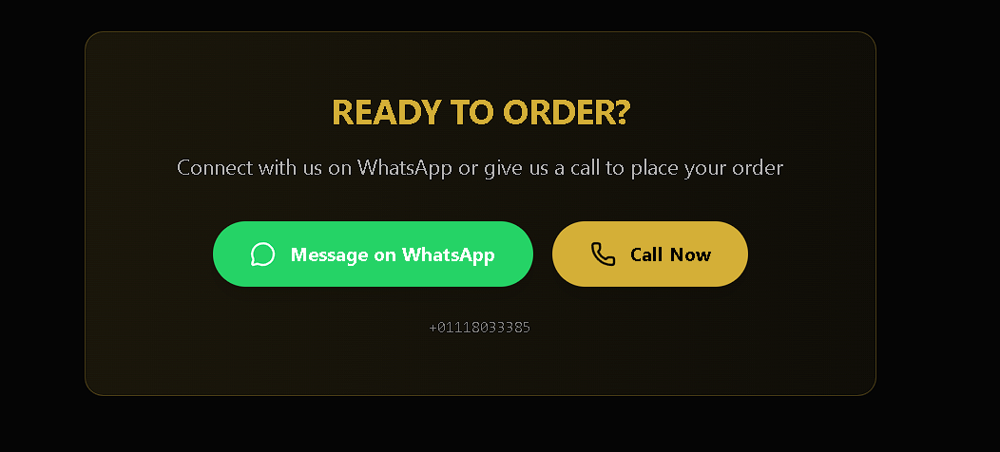
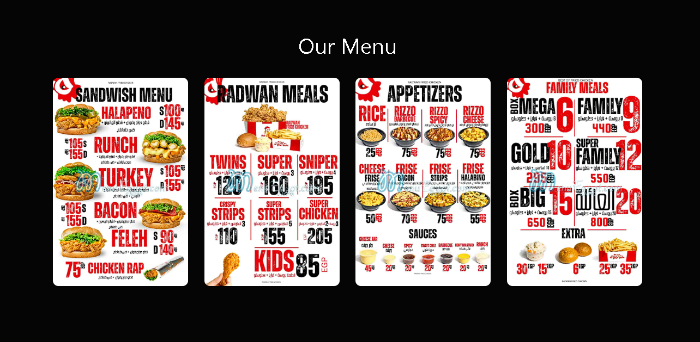
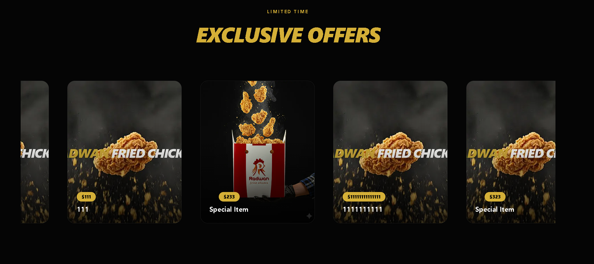

🎨 3D Radwan Animation
: 🔗 [Radwan Link](https://radwanfried.vercel.app/)

A modern 3D animation–driven web experience built with Next.js, React, and Framer Motion, focused on smooth visuals, interactive motion, and high-performance rendering.

This project explores bringing cinematic 3D sequences and rich UI animations to the web using a clean, scalable frontend architecture.


# 📷 Screenshots


  
  



---

## ✨ Features

- 🌀 High-quality 3D animation sequences  
- ⚡ Next.js App Router for fast routing and rendering  
- 🎬 Framer Motion for smooth, expressive animations  
- 🎨 Tailwind CSS for rapid, consistent styling  
- 🧠 TypeScript for type safety and maintainability  
- 🧩 Reusable component architecture  
- 🚀 Optimized for performance and modern browsers  

---

Modern admin dashboard for real-time asset curation and management.
- **Asset Curation**: Integrated upload widget for new promotional offers.
- **Metadata Management**: Fine-tune gallery details including titles, prices, and descriptions.
- **Folder Navigation**: Structured organization within the `radwan` Cloudinary namespace.
- **Secure Operations**: Powered by Next.js Server Actions for robust resource handling (Delete/Edit).

🔐 Environment Variables

To run this project, you will need to add the following variables to your `.env` file:

`NEXT_PUBLIC_CLOUDINARY_CLOUD_NAME`=your_cloud_name

`NEXT_PUBLIC_CLOUDINARY_API_KEY`=your_api_key

`CLOUDINARY_API_SECRET`=your_api_secret

`NEXT_PUBLIC_CLOUDINARY_UPLOAD_PRESET`=your_upload_preset

🛠 Tech Stack


## websites Links 
🔗 [Main Website](https:/radwanfried.vercel.app)
<!-- Main Website: 🔗 [Main Website](https://radwanfriedtripppyyy.vercel.app/)
 Main Website: 🔗 [Main Website](https://radwanfried-git-main-sspotters-projects.vercel.app/)

Development Branch 2: 🔗 [MultiVideo Branch](https://radwanfriedtripppyyy-git-multivid-sspotters-projects.vercel.app/) -->


# Project

```
📁 Project Structure
src/
├── app/              # App Router pages & layouts
├── components/       # Reusable UI components
public/
├── sequence/         # Image sequences (animation frames)
ProjectPrompts/
├── *.md              # AI / animation prompt documentation
```


Ensures consistent formatting, best practices, and clean TypeScript usage.

## 🎞 Animation Notes

* Image sequences stored in `public/sequence/`
* Animations orchestrated using **Framer Motion**
* Designed to support future **WebGL / Three.js** extensions

---

## 🧠 Project Goals

* Showcase immersive 3D motion on the web
* Maintain clean, readable, and scalable codebase
* Push visual storytelling using modern frontend tools

---
## 🌍 Development Branches

Live development versions of the project are available here:
🔗 [Main Website](https://radwanfried.vercel.app/)

---
# Videos Used
<!-- <p>
<video controls src="vid1.mp4" title="Title"></video>
<video controls src="Vide2.mp4" title="Title"></video>
</p> -->

<div style="display: flex; gap: 20px;">
  <div style="flex: 1; border: 1px solid #7c7c7c; padding: 5px;">
    <video controls src="vid1.mp4" style="width: 100%;"></video>
    <p style="text-align: center;">Box Explosion</p>
  </div>
  <div style="flex: 1; border: 1px solid #7c7c7c; padding: 5px;">
    <video controls src="Vide2.mp4" style="width: 100%;"></video>
    <p style="text-align: center;">Fried Rotation</p>
  </div>

</div>

---
---

Main Website: 🔗 [Main Website](https://radwanfried.vercel.app/)

Development Branch 2: 🔗 [MultiVideo Branch](https://radwanfried.vercel.app/)
---

Made with ❤️ using Interactive Ui.

```

If you want, I can also generate a simplified version or add sections like Contribution Guidelines or FAQ.
```